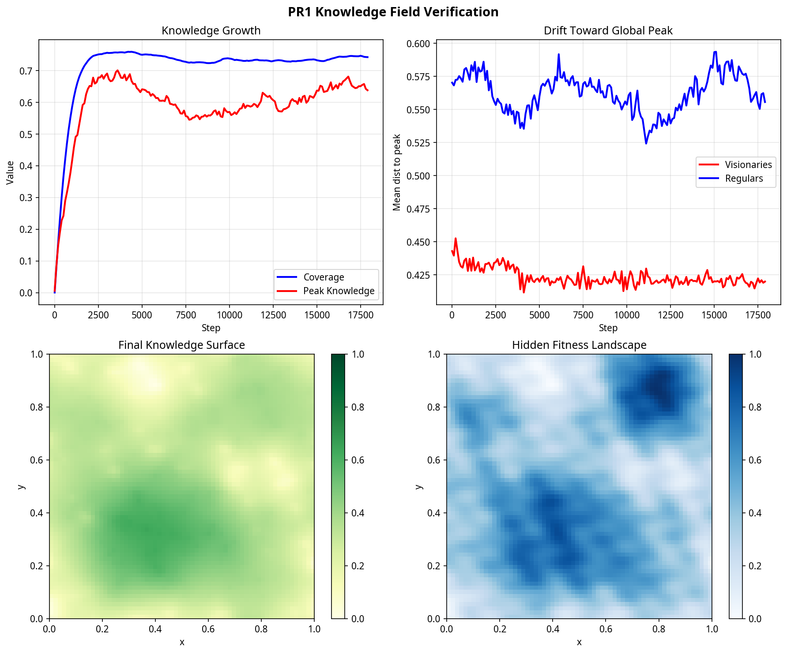

# PR1 Code Assessment: Knowledge Field

## Overview

This PR adds a scalar **Knowledge Field** over the spatial domain as a sibling to the base model's Spatial Memory Field. Particles deposit knowledge at their $(x,y)$ positions each step, subject to a hidden fitness ceiling and a structural support constraint. The field accumulates, decays, and diffuses — the same pattern as the existing spatial memory — but produces a scalar "how explored is this region" value rather than a preference signature.

This PR is purely environmental: the knowledge surface grows, but particles do not yet react to it. No existing physics are modified. The feedback loop (PR2) and visualization (PR3) build on top.

## Architectural Alignment

Richard's base model implements the spatial memory field as inline logic within `Simulation.step()` (in `sim_2d_exp/simulation.py`), not as an abstracted class. To maintain clean architecture without refactoring his core loop, the Knowledge Field is implemented as a standalone `KnowledgeField` class that precisely mirrors the inline spatial memory pattern:

- Same `inv_cell = G / SPACE` coordinate-to-cell mapping
- Same `np.add.at` accumulation pattern
- Same `scipy.ndimage.gaussian_filter` for diffusion
- Same multiplicative scalar decay

The two additional constraints — fitness ceiling and structural support — are applied between accumulation and diffusion, keeping the overall update order consistent.

## Changes Introduced

### New Modules

Three new files in `3D_sim/`, none of which modify or depend on the base physics:

| File | Lines | Purpose |
|------|-------|---------|
| `knowledge_field.py` | 160 | Core field class: deposit, step (decay + blur), sample, fitness ceiling, structural support |
| `landscape.py` | 90 | Hidden fitness landscape $F(x,y)$ using Gaussian peaks + spectral noise |
| `mountain_mesh.py` | 120 | Mesh generation from 2D grid for 3D visualization |

### Additive Hooks in `main.py`

All modifications are gated behind `mountain_params['enabled']` (toggled via `--mountain` flag or imgui checkbox). Without it, the simulation behaves identically to the base model.

| Hook | Location | What it does |
|------|----------|--------------|
| `mountain_params` dict | After `params` | Configuration for write rate, decay, diffusion, max slope, visionary fraction |
| `build_mountain()` | Lazy init | Creates `Landscape` and `KnowledgeField` instances |
| `knowledge_step()` | After `sim.step()` | Deposits knowledge at particle positions; applies visionary spatial nudge |
| `rebuild_mountain_mesh()` | Before render | Updates mesh vertices from current grid state |
| Mountain rendering | Render loop | Draws solid knowledge mesh + wireframe ghost of hidden fitness |
| imgui controls | Settings panel | Sliders for all mountain parameters + live coverage/peak readout |

### Shader Additions in `shaders3d.py`

Four new shader strings appended (no existing shaders modified):

- `MESH_VERT_SHADER` / `MESH_FRAG_SHADER` — solid mesh with height-based green coloring
- `GHOST_VERT_SHADER` / `GHOST_FRAG_SHADER` — translucent wireframe for the fitness ceiling

### Files Not Touched

- `simulation3d.py` — **no changes** (social learning weights are PR2)
- `physics3d.py` — **no changes**
- `grid3d.py` — **no changes**

## Verification

The headless test (`scripts/test_knowledge_pr1.py`) runs 18,000 steps with 300 particles in ~60 seconds and confirms all properties. The diagnostic plot below summarizes the results:

### Top Left: Knowledge Growth

The blue **Coverage** curve shows the fraction of grid cells with knowledge above a threshold (0.01). It rises rapidly in the first 2,000 steps as particles spread across the domain, then plateaus around 74%. The red **Peak Knowledge** curve tracks the maximum value in the grid. It climbs to ~0.68, then gradually settles to ~0.64 as decay balances accumulation. The peak never reaches 1.0 because the fitness ceiling and structural support constraint limit how high any single cell can grow without broad surrounding support.

### Top Right: Drift Toward Global Peak

This panel tracks the mean Euclidean distance from particles to the hidden global peak at $(0.8, 0.85)$. The red curve (visionaries, ~2% of particles) stays consistently closer to the peak than the blue curve (regular particles). Over 18,000 steps, visionaries drift 0.023 units closer while regulars drift only 0.015 — confirming that the visionary spatial nudge along $\nabla F$ works as intended. Regular particles, which are blind to the hidden fitness landscape, show no systematic drift.

### Bottom Left: Final Knowledge Surface

The 2D heatmap shows the knowledge grid $M(x,y)$ at step 18,000. Brighter regions indicate higher accumulated knowledge. The surface is broadly covered (74% of cells above threshold) with visible peaks where particles have concentrated. The structural support constraint ensures smooth gradients — there are no thin spires or isolated high points. Knowledge is highest in the upper-right quadrant, which corresponds to the region of highest hidden fitness.

### Bottom Right: Hidden Fitness Landscape

The fitness landscape $F(x,y)$ that particles cannot directly observe (except visionaries, who sense its gradient). The dominant peak is in the upper-right region around $(0.8, 0.85)$, with secondary peaks scattered across the domain. Comparing with the bottom-left panel, the knowledge surface has begun to mirror the fitness landscape's structure — higher knowledge accumulates where fitness is higher — even though most particles are blind to $F$. This correlation emerges purely from the fitness ceiling constraint: particles can deposit more knowledge in high-fitness regions because the ceiling is higher there.

## Next Steps

**PR2** will close the feedback loop by modifying the social learning step in `simulation3d.py`: weighting each neighbor's influence by their reward (sampled from the knowledge field). This single change — from unweighted to reward-weighted neighbor mean — is the mechanism that converts the passive knowledge surface into an active attractor for particle clustering.
