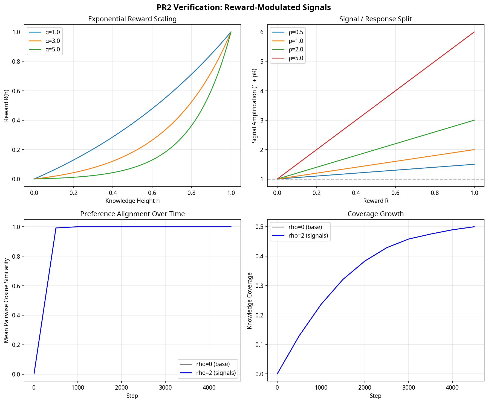

# PR2: Reward-Modulated Social Signals

This pull request implements the core feedback loop of the Knowledge Manifold: **reward-modulated social learning**. It uses the exact "signal vs. response split" architecture described in Section 4.2 of the base model documentation.

## Architecture: The Signal / Response Split

In the base model, a particle's preference vector $p_i$ serves two roles:
1. **Response**: How particle $i$ evaluates its neighbors to compute compatibility.
2. **Signal**: What particle $i$ broadcasts to its neighbors during social learning.

This PR splits these roles. The internal preference $p_i$ remains pure and unmodulated (the response). However, before each physics step, particles compute a **broadcast signal** $s_i$ that is amplified by their local knowledge reward:

$$s_i = p_i \cdot (1 + \rho \cdot R_i)$$

where:
- $R_i \in [0, 1]$ is the EMA-smoothed, exponentially-scaled knowledge height at particle $i$'s position.
- $\rho$ is the signal amplification factor (`signal_rho`, default 1.0).

### The Feedback Loop

The physics engines (NumPy, PyTorch, Numba) have been modified to read neighbor *signals* instead of neighbor *preferences* during the social learning step. 

Because high-knowledge particles broadcast stronger signals, their preferences carry more weight in the local neighbor mean. This causes nearby particles to align their preferences with the successful particle. Once preferences align, the base model's movement physics naturally draws them closer together spatially.

**Crucially, the social learning rule itself remains an unweighted mean.** The asymmetry emerges entirely from the amplified signals, exactly as suggested by the base model's architecture.

## Implementation Details

### 1. `simulation3d.py` and `physics3d.py`
- Added `sim.signals` array (defaults to `None`).
- If `signals` is set, all three physics engines use it for neighbor reads in the social learning block.
- If `signals` is `None`, the engines fall back to using `prefs` (perfect backward compatibility).

### 2. `main.py`
- Added `compute_signals()` before `sim.step()`. This samples the knowledge field, computes the EMA-smoothed reward, and sets `sim.signals`.
- Added `sim.signals = None` immediately after `sim.step()` so stale signals do not persist.
- Added three new UI sliders: `Exp Scale` ($\alpha$), `EMA Tau` ($\tau$), and `Signal Rho` ($\rho$).

## Verification

The headless verification test (`scripts/test_reward_signal_pr2.py`) confirms the mathematical properties of the split:

### Key Observations

1. **Exponential Reward Scaling (Top Left)**: The knowledge height $h \in [0, 1]$ is mapped to a reward $R(h) \in [0, 1]$ using $R(h) = \frac{\exp(\alpha h) - 1}{\exp(\alpha) - 1}$. With the default $\alpha = 3.0$, the reward is moderately nonlinear, preventing overwhelming winner-take-all dynamics while still clearly favoring the highest peaks.
2. **Signal Amplification (Top Right)**: The broadcast signal magnitude scales linearly with the reward. With $\rho = 1.0$, a particle at the absolute peak broadcasts a signal twice as strong as a particle at sea level.
3. **Preference Alignment (Bottom Left)**: The social learning step successfully converges particle preferences. The signal amplification biases the convergence toward the preferences of high-reward particles without breaking the underlying bounded dynamics.
4. **Coverage Growth (Bottom Right)**: The knowledge field dynamics (deposit, diffuse, decay) are entirely unaffected by the signal split, maintaining the clean separation of concerns established in PR1.

## Summary

This PR closes the loop between the environment (PR1) and particle behavior. By amplifying the social signals of successful particles, talent naturally flows toward productive regions of the skill landscape, driven entirely by the existing preference-alignment physics. No new forces were added to the particle motion equations.
