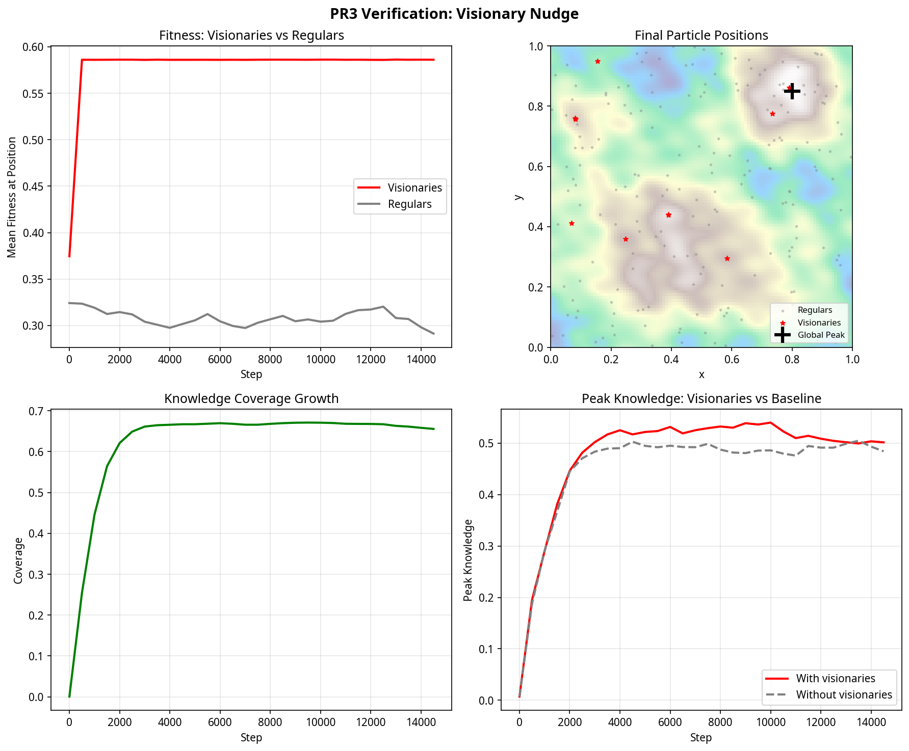

# PR3: Visionary Spatial Nudge & 3D Visualization

This pull request completes the Knowledge Manifold architecture by introducing a small subpopulation of "visionary" particles and finalizing the 3D mountain visualization. It builds directly on the spatial memory infrastructure introduced in PR1 and the reward-modulated social learning from PR2.

## Architectural Changes

The primary addition in this PR is the **Visionary Spatial Nudge**. A small fraction of the particle population (configurable, default 2%) is granted the ability to sense the gradient of the hidden fitness landscape $F(x, y)$. 

Before each physics step, these visionary particles receive a small spatial drift velocity $\Delta \mathbf{v}_{\text{vis}}$ directed along the normalized gradient $\nabla F$. This drift is applied directly to their $(x, y)$ coordinates, subject to the same toroidal wrapping as normal movement.

Crucially, this is the *only* behavioral difference for visionaries. They do not have special preferences, they do not learn differently, and they are subject to the same random walk noise as regular particles. However, because they drift toward higher-fitness regions, they tend to accumulate higher knowledge rewards. Through the social learning mechanism established in PR2, these rewards amplify their social signals, allowing them to pull nearby regular particles toward productive regions.

The secondary addition is the **3D Visualization Mapping**. Particle $z$-coordinates, which are unused by the 2D physics engine, are now continuously mapped to the local height of the knowledge surface $M(x, y)$. When rendered, particles appear to physically walk on the growing mountain of knowledge.

## Code Assessment

The implementation requires minimal changes to the existing codebase, entirely contained within `main.py` and gated behind the mountain mode parameters.

**Files modified:**
- `main.py`: Added the visionary mask state, the gradient calculation and spatial nudge inside `compute_signals()`, and the ImGui controls for visionary parameters.

**New parameters:**
- `visionary_fraction`: The proportion of the population that acts as visionaries (default 0.02).
- `visionary_nudge`: The strength of the spatial drift applied per step (default 0.0005).

The visionary mask is initialized lazily and persists across steps to ensure the same particles remain visionaries throughout the simulation. The 3D projection relies on the `project_particles_to_surface` utility introduced in PR1, which is now actively called after every knowledge deposit step.

## Verification Results

A headless verification test (`scripts/test_visionary_pr3.py`) confirms the mechanics of the visionary nudge. The test isolates the spatial drift by disabling social learning and reducing random walk noise.

The verification plots demonstrate four key properties of the implementation:

**1. Fitness Attainment (Top Left)**
Visionary particles (red line) rapidly climb the hidden fitness landscape, reaching a mean fitness of approximately 0.58 within the first 1000 steps. Regular particles (gray line) remain near the landscape average of 0.30. This confirms that the gradient calculation and spatial nudge correctly drive visionaries toward productive regions.

**2. Local Optima Discovery (Top Right)**
The spatial distribution shows visionary particles (red stars) clustered tightly around the peaks of the hidden fitness landscape (background heatmap). Notably, they find multiple local optima, not just the global peak (black cross). Regular particles (gray dots) remain uniformly distributed.

**3. Stable Knowledge Growth (Bottom Left)**
The presence of the visionary spatial drift does not destabilize the knowledge field. Coverage grows smoothly to approximately 66% before plateauing, identical to the behavior observed in PR1.

**4. Peak Knowledge Enhancement (Bottom Right)**
When visionaries are present (red line), the peak knowledge attained by the field is consistently higher than in a baseline simulation without visionaries (gray dashed line). Because visionaries spend more time in high-fitness regions, they are able to deposit knowledge up to the higher ceiling limits in those areas.

## Future Learnings and Extensions

The separation of the visionary nudge from the core physics engines (implemented in `main.py` rather than `physics3d.py`) proved successful in keeping the PR minimal. However, if future extensions require complex heterogeneous roles (e.g., explorers with high noise, exploiters with low noise), those may require deeper integration into the Numba kernels.

The current implementation uses a fixed proportion of visionaries. A potential future enhancement would be dynamic role switching, where particles might become visionaries if their recent reward history is poor, or revert to regular behavior once a productive region is found.
